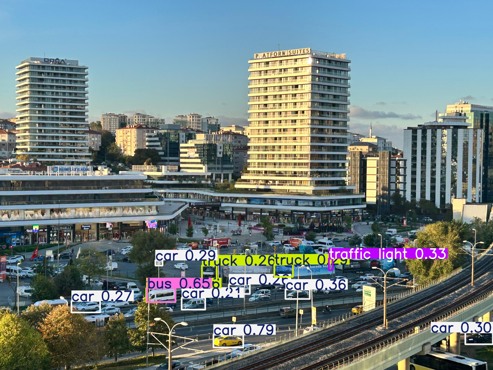
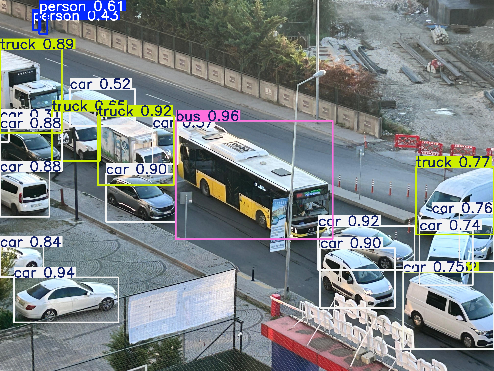
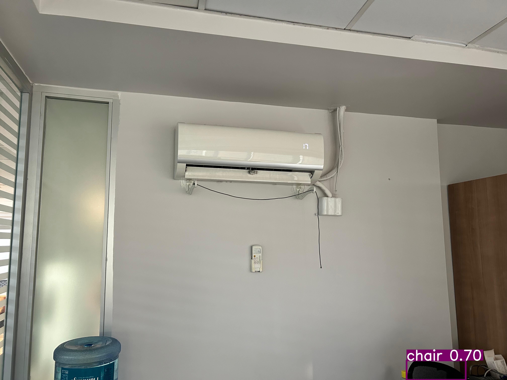
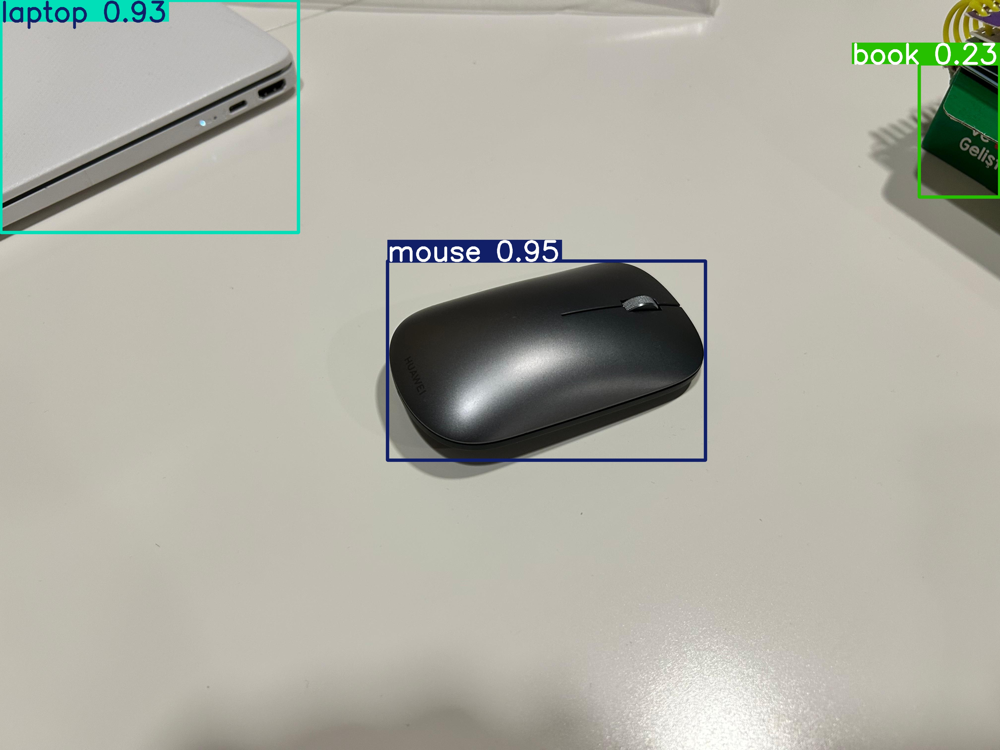
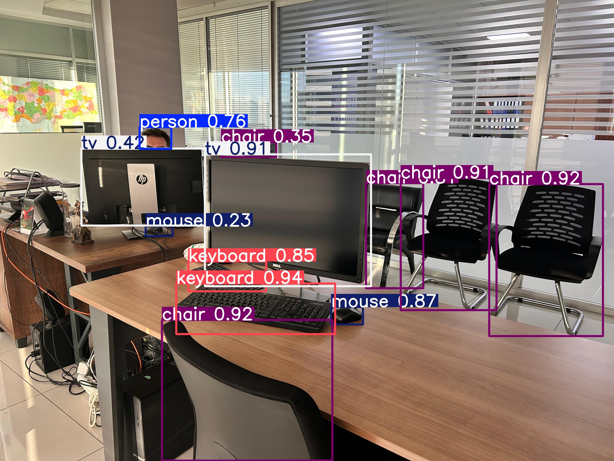
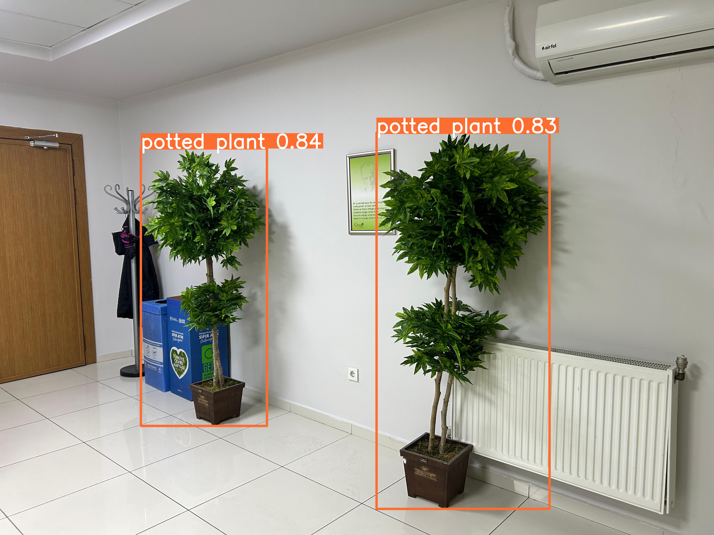
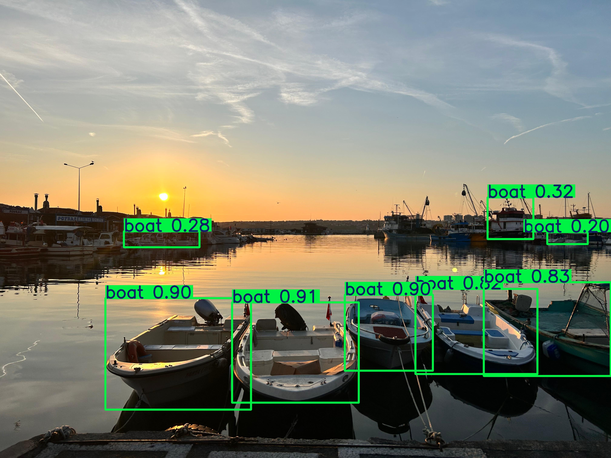
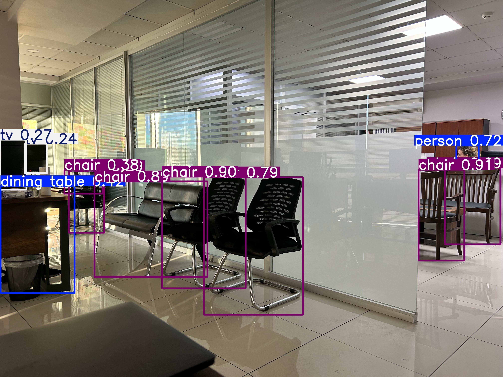
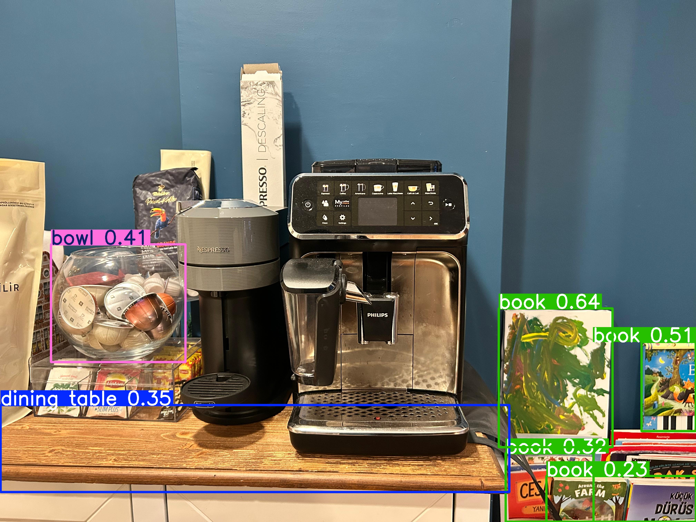

# Görsel işleme ve sonuçları

Bu proje, YOLOv11x modeli kullanılarak bir dizi görselde nesne tespiti yapılmak istenmiştir.

## 1. Gereksinimler
Bu projeyi çalıştırmak `ultralytics` kütüphanesi kullanılmıştır.

### 2. Kullanılan YOLO Modeli
- Bu projede **YOLOv11x** modeli kullanılmıştır. Bu model, nesne tespiti konusunda çok yüksek doğruluk oranına sahiptir ve karmaşık görüntülerde bile çok sayıda nesneyi doğru şekilde tespit edebilir.
- **Güven Eşiği (`conf`)**: Bu parametre 0.20 olarak belirlenmiştir, yani model, tespit edilen nesnelerin %20 veya daha fazla güvenle doğru olduğuna inanıldığı durumlarda bu nesneleri döndürecektir.
- **Cihaz Seçimi (`device`)**: `cpu` seçilmiştir. Bu nedenle model, CPU üzerinde çalışmaktadır.

### 4. Sonuçlar ve Görsellerin Değerlendirilmesi
Projede, yalnızca YOLOv11x modeli değil, diğer YOLO modelleri de denenmiş olup **YOLOv11x modeli en yüksek doğruluk oranında çalışmıştır**. Görsel olarak şehir görselleri ve daha spesifik nesneler (kumanda, fare vb.) kullanılmıştır.

#### 1 No.lu Görsel

1 no.lu görselde yoğun araç trafiği ve binalar bulunmaktadır. Model, araçları tanımış ancak binaları tanıyamamıştır.

#### 2 No.lu Görsel

2 no.lu görselde tüm araçlar tanınmış ve otobüs, kamyon, otomobil olarak sınıflandırılmıştır.

#### 3 No.lu Görsel

3 no.lu görselde açıkça görülen bir klima cihazı tanınmamış, ancak kısmen görünmesine rağmen sandalye tanınmıştır. Bu durum, klima ile duvar renginin yakın olmasına bağlanabilir.

#### 4 No.lu Görsel

4 no.lu görselde bir bilgisayar faresi ile kısmen kadrajda bulunan laptop ve kitap tanınmıştır.

#### 5 No.lu Görsel

5 no.lu görselde masa, sandalye ve bilgisayar tamamen tanınmış, ilave olarak yüzü kısmen görülen bir insan yüksek oranda tanınmıştır.

#### 6 No.lu Görsel

6 no.lu görselde 2 adet yapay bitki açıkça tanınmıştır.

#### 7 No.lu Görsel

7 no.lu görselde teknelerin büyük bir kısmı yüksek oranda tanınmıştır.

#### 8 No.lu Görsel

8 no.lu görselde masa, sandalye tamamen tanınmış, ilave olarak yüzü kısmen görülen bir insan yüksek oranda tanınmıştır.

#### 9 No.lu Görsel

9 no.lu görselde bir kumanda ve oyun gamepadi tanınmıştır.

#### 10 No.lu Görsel

10 no.lu görselde 2 adet kahve makinası ana nesne olarak bulunmakta ancak model bu nesneleri tanıyamamış, görseldeki diğer nesneleri (kitap ve kavanoz) tanımıştır. Kahve makinalarının model veri setinde olmama ihtimali ve çok fazla parçadan oluşmaları nedeniyle tanınamadıkları düşünülmektedir.

### 5. Sonuç
- **Modelin Başarısı ve Görsel Yoğunluk**: Modelin başarısı ile görsel yoğunluk arasında doğrusal bir ilişki görülmüştür. Nesneler ile fon ayrışmasının çok önemli olduğuna kanaat getirilmiştir.
- **Büyük ve Küçük Nesneler**: Modelin ev, bina gibi büyük yapılardan çok daha küçük (görselde daha az yer kaplayan) nesneleri tanıyabildiği düşünülmektedir.
- **Güven Eşiği ve Doğruluk**: Conf değeri %50'nin üzerinde iken bariz olan bazı nesneler tanınmazken, %20 seviyelerinde daha gerçekçi sonuçlar elde edilmiştir. Bu durum, modelin düşük güven eşiğiyle daha fazla nesne tanıdığı ve bu şekilde daha fazla ayrıntıyı yakalayabildiği şeklinde yorumlanabilir.

Bu sonuçlara dayanarak, modelin doğruluğunu ve performansını artırmak için daha dengeli bir veri seti ve daha spesifik eğitim verileri kullanılması önerilmektedir. Ayrıca, büyük nesnelerin tespit edilebilmesi için daha fazla veri ile eğitilmesi ve farklı arka plan ayrışmalarına odaklanılması faydalı olabilir.
